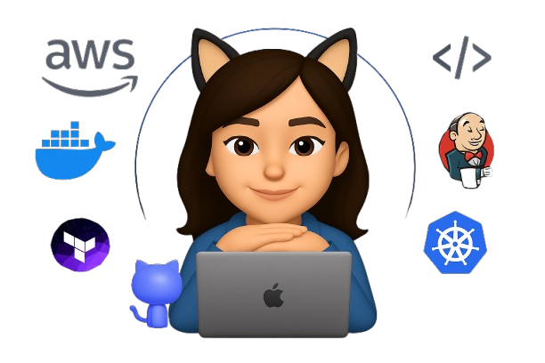

</a>

 

Hola, soy <b>Liz</b>, <b>Ingeniera DevOps</b> apasionada de la automatización.

## 🙈 About Me

Me apasiona construir infraestructuras resilientes, seguras y escalables usando herramientas modernas como **AWS, Kubernetes (EKS/Fargate), Terraform, Jenkins, GitLab CI/CD y Docker**. Me enfoco en mejorar la eficiencia operativa a través de prácticas como **Infrastructure as Code (IaC)**, **observabilidad** y **GitOps**.

> “Basada en Colombia, construyendo infraestructuras que no se caen (al menos no sin monitoreo).”

### 🚀 Áreas de experiencia
- 📦 Contenedores y orquestación: Docker, Kubernetes, Helm
- ☁️ Cloud: AWS (IAM, EKS, S3, CloudWatch, API Gateway)
- 🔐 Seguridad en la nube: STS, políticas IAM, MFA, Web Identity
- 🔧 Automatización: Jenkins, GitLab, Terraform, Ansible
- 🔍 Observabilidad: Prometheus, Grafana, Loki, AWS X-Ray
- 🛠️ CI/CD: GitOps, integración con bots, despliegues automatizados
- 🤖 Integración de herramientas con chatbots (como Errbot)

<code></code>
<code></code>
<code></code>
<code></code>
<code></code>    

---

### 🧩 Actualmente explorando
- 📊 Monitoreo avanzado con AWS X-Ray y sidecars
- 🔄 Optimización de pipelines y control de versiones en infraestructuras complejas

---

> “Automatiza lo repetitivo. Observa lo invisible. Escala lo esencial.”

Puedes ver algunos de mis proyectos, configuraciones y experimentos aquí en GitHub, o conectarte conmigo para compartir ideas sobre infraestructura, automatización y nuevas tecnologías.

#### Top Repositories

